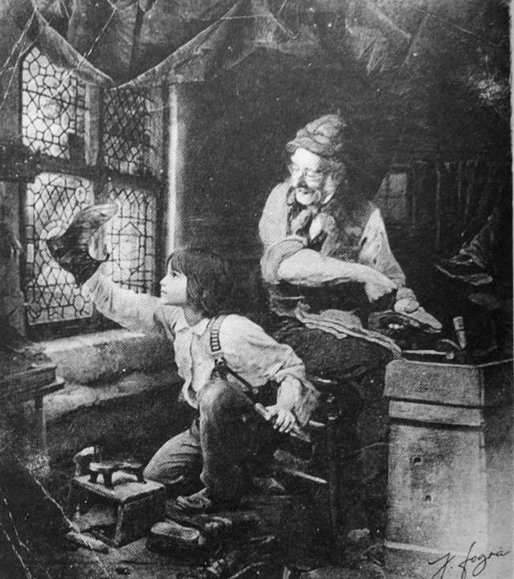

When we think of acts of unimaginable cruelty—like the atrocities committed in Auschwitz, or the horrific torture of prisoners in Saydnaya Prison in Syria—it’s tempting to dismiss the perpetrators as fundamentally evil people, wholly different from us. We might console ourselves by believing, “I could never do that.” But how can we be so sure that we are different from these people?

What, then, pushes someone to step outside their moral code, to not just tolerate evil but actively participate in it? Is it political pressure? Economic hardship? Or is the root cause psychological, a failure of moral reasoning that allows corruption to thrive in the form of obedience or duty?

I recenetly met with a former Saydnaya prisoner who was unjustfully imprisoned and tortured for 11 months at the Saydnaya prison in Syria. He spoke for two hours on the unimaginable torture and suffering he went through at the Saydnaya prison. The experience was a nothing short of a living nightmare. He recalled having to sleep with the bodies of dead prisoners in his cell after they were brutally tortured to death and their bodies were left to rot for a couple of days beside him. After being shown in front of a judge, he was finally let go, but to continue living in Syria was not a choice for him anymore, he had to leave Syria and come to Cairo. Now, he runs a coffe stand from the back trunk of a car.

# Our Moral Reasoning   

Human behavior is deeply influenced by moral reasoning. But how do we know what's right from wrong? From a young age, we learn and understand social norms and values by observing and imitating those around us, like parents or caregivers. We're great mimics, we do that all the time. This process, called observational learning, helps us fit in society and feel accepted. When we imitate by mimicking the actions and behaviors of those around us, especially the people we trust, we’re not just copying their actions—we’re also absorbing something much deeper: their value structure.

A value structure, is like a mental hierarchy of what matters most to us. At the top are the things we prioritize above all else, and at the bottom are the things we care about the least. This hierarchy helps us navigate life, reducing confusion and chaos by guiding our decisions and actions. Previous studies have shown that values relate to choice behavior in real-life situations (summarized in Schwartz & Bardi, 2001). When faced with any choice in our daily interactions, our moral compass—shaped by this value structure—helps us decide what to do.

Our values are often inherited from our ancestors. For example, we value things like honesty or bravery because these traits have been passed down as important through generations. But this raises an important question: when should we challenge the value structure we’ve inherited? How do we know that our moral compass will not mislead us as life becomes more complex?

In my day-to-day actions and as I grew older, I often found myself conflicted with a moral dilemma that stemmed from complicated situations. Sometimes, I’ve found myself questioning whether I should adhere to a particular moral code or whether it’s acceptable to redefine my values. But where do we draw the line? If we start modifying our moral codes, how do we ensure we’re not losing ourselves in the process?

At first, this may seem like a trivial issue. "We all know the difference between good and evil by heart". Fair enough, but consider the following. The Nazi Auschwitz guards who tortured thousands of inncocent people in the concertation camps, the Israeli prison guards who did the same to the Palestinians, or the guards in Saydnaya Prison who inflicted unimaginable suffering to syrian prisoners. It’s easy to label them as monsters, as inherently evil. But can we be so certain that we wouldn’t have acted the same in their circumstances? So you might say: "Evil people did this", and again, fair enough, *but don't be so sure that these people aren't you.* 

Now that’s a deeply unsettling thought, and it's a deeply uncomfortable question to ask yourself, but I believe it’s an important one. Instead of only asking, “How do I avoid becoming like them?” we should also ask, “What would it take for me to become like them?”

I reflect on this often, more than I should perhaps. But after reflecting on this, I came to conclude that it’s not just a political or economical issue. Those factors might be the reason for such evil actions to some degree, but they don’t explain the willingness to commit such acts. At its core, this is a psychological issue. There is no economical reason as to why someone would torture another human and have them suffer under their dominion—it’s simply a corruption of moral reasoning.

But why is this important? Why should I care? Why should I contemplate such a thought? And the answer is, understanding this isn’t just about confronting the darkness in others; it’s about safeguarding ourselves.

When you specify something to that depth, you're also defining it's opposite. So if there's evil to that extent then there is, at least in theory, the opposite. So while I was looking into the heart of darkness, once again, the light started to shine through. Contemplating these questions is uncomfortable, but it is essential. If we don’t consider what could drive us to such darkness, how can we ever understand what keeps us in the light?

I recenetly met with a former Saydnaya prisoner who was unjustfully imprisoned and tortured for 11 months at the Saydnaya prison in Syria. He spoke for two hours on the unimaginable torture and suffering he went through at the Saydnaya prison. The experience was a nothing short of a living nightmare. 

One of the most harrowing aspects of his story at Saydnaya was psychological torture. Prisoners were often blindfolded, chained, and lifted to stand in the air in stress positions for hours, and subjected to sleep deprivation. He recalled having to sleep with the bodies of dead prisoners in his cell after they were brutally tortured to death and their bodies were left to rot for a couple of days beside him.

During the months he spent there, when I asked him what he thought about during the darkest moments and what were the "positive" thoughts, he said that, daily, his hope was to go through the day and eat without being beaten. After being shown in front of a judge, he was finally let go, but to continue living in Syria was not a choice for him anymore, he had to leave Syria and come to Cairo. Now, he runs a coffe stand from the back trunk of a car. Fleeing to Cairo was not a choice but a necessity. Yet, even this modest effort speaks to his resilience, a testament to the human spirit’s capacity to endure and rebuild even after being subjected to the depths of human cruelty.

