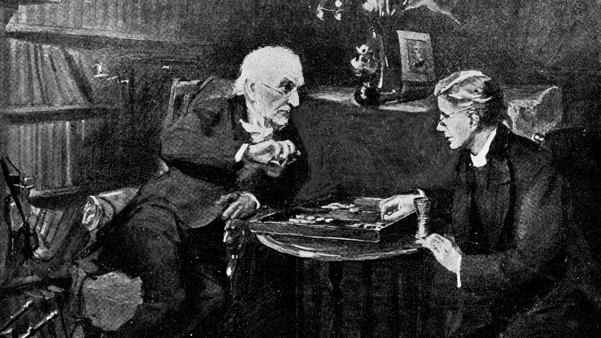

When we think of acts of unimaginable cruelty—like the atrocities committed in Auschwitz, or the horrific torture of prisoners in Saydnaya Prison in Syria—it’s often the case that we tend to label the perpetrators as fundamentally evil people, wholly different from us. We might console ourselves by believing, “I could never do that.” But how can we be so sure that we are different from these people?

What, then, pushes someone to step outside their moral code, to not just tolerate evil but actively participate in it? Is it political pressure? Economic hardship? Or is the root cause psychological, a failure of moral reasoning that allows corruption to thrive in the form of obedience or duty? 

In this blog post, I want to explain, from my point of view, the danger of straying away from our moral principles. When we believe we can stretch our boundaries, we may actually be engaging in something far more harmful than it initially appears.

# Understanding the Foundations of Moral Reasoning

Human behavior is shaped by moral reasoning, but how do we determine right from wrong? From an early age, we learn social norms and values through observing and imitating those we trust, like parents or caregivers. We're great mimics, we do that all the time. This observational learning not only helps us fit into society but also ingrains a deeper value structure, because when we imitate the actions and behaviors of those around us, especially the people we trust, we’re not just copying their actions—we’re also absorbing something much deeper: their value structure.

A value structure, is like a mental hierarchy of what matters most to us, a hierarchy of values guiding our choices. At the top are the things we value above all else, and at the bottom are the things we care about the least. This hierarchy helps us navigate life. At its core, this structure reduces uncertainty, helping our moral compass steer our decisions. Previous studies have shown how these values influence real-life choices (Schwartz & Bardi, 2001).

Since our values are often inherited from our ancestors, we often act in the same way that they did, which is often a good thing. For example, we value things like honesty, integrity or bravery because these traits have been passed down as important through generations. But this raises an important question: when should we challenge the value structure we’ve inherited? How do we know that our moral compass will not mislead us as life becomes more complex?

In my day-to-day actions and as I grew older, I often found myself conflicted with a moral dilemma that stemmed from complicated situations. Sometimes, I’ve found myself questioning whether I should adhere to a particular moral code or whether it’s acceptable to redefine my values. But where do we draw the line? If we start modifying our moral codes, how do we ensure we’re not losing ourselves in the process and maintain our core identity?

At first, this may seem like a trivial issue. "We all know the difference between good and evil by heart". Fair enough, but consider the following. The Nazi Auschwitz guards who tortured thousands of inncocent people in the concertation camps, the Israeli prison guards who did the same to the Palestinians, or the guards in Saydnaya Prison who inflicted unimaginable suffering to syrian prisoners. It’s easy to label them as monsters, as inherently evil. But can we be so certain that we wouldn’t have acted the same in their circumstances? So you might say: "Evil people did this", and again, fair enough, *but don't be so sure that these people aren't you.* 

Now that’s a deeply unsettling thought, and it's a deeply uncomfortable question to ask yourself, but I believe it’s an important one. Instead of only asking, “How do I avoid becoming like them?” we should also ask, “What would it take for me to become like them?”

I reflect on this often, more than I should perhaps. But after reflecting on this, I came to conclude that it’s not just a political or economical issue. Those factors might be the reason for such evil actions to some degree, but they don’t explain the willingness to commit such acts. At its core, this is a psychological issue. There is no economical reason as to why someone would torture another human and have them suffer under their dominion—it’s simply a corruption of moral reasoning.

But why is this important? Why should I care? Why should I contemplate such a thought? And the answer is, understanding this isn’t just about confronting the darkness in others; it’s about safeguarding ourselves. 

I recently met with a former Saydnaya prisoner who was unjustly imprisoned and tortured for 11 months at the Saydnaya prison in Syria. He spoke for two hours on the unimaginable torture and suffering he went through at the Saydnaya prison. The experience was a nothing short of a living nightmare. Prisoners were blindfolded, chained, and lifted to stand in the air in stress positions for hours, and subjected to sleep deprivation. He recalled having to sleep with the bodies of dead prisoners in his cell after they were brutally tortured to death and their bodies were left to rot for a couple of days beside him.

During the months he spent there, when I asked him what he thought about during the darkest moments and what were the "positive" thoughts, he said that, daily, his highest hope was to go through the day and have his meal “without being beaten”.  This shows you what happiness is like under these conditions. His other thought was suicide, which would have been a relief for him by then, but only he didn’t have the means to do so.

Now let’s consider the people who did this to him, they were normal human beings, just like you, probably with family and children who they cared about, again like you. To label them as completely different, or as fundamentally evil would be to bury our heads in the sand from the real issue here. Because maybe this was just a guard doing his job, executing this torture was his duty, as he would convince himself. So these people weren't completely different from us, to everyone's surprise, these people were just like you. 

So how did they reach a point where they are actively participating in evil acts? The answer is, they kept straying away from their fundamental moral codes, one tiny unethical act a time. 

My aim is to clarify that we must exercise extreme caution when stepping outside our moral boundaries. As we drift from our principles—one tiny step at a time—we’re reshaping our value structure and risk losing our core moral values in the process.

>I'm terrified at the moral apathy, the death of the heart, which is happening in my country. These people have deluded themselves for so long that they really don't think I'm human. And I base this on their conduct, not on what they say. And this means that they have become in themselves moral monsters.

James Baldwin

