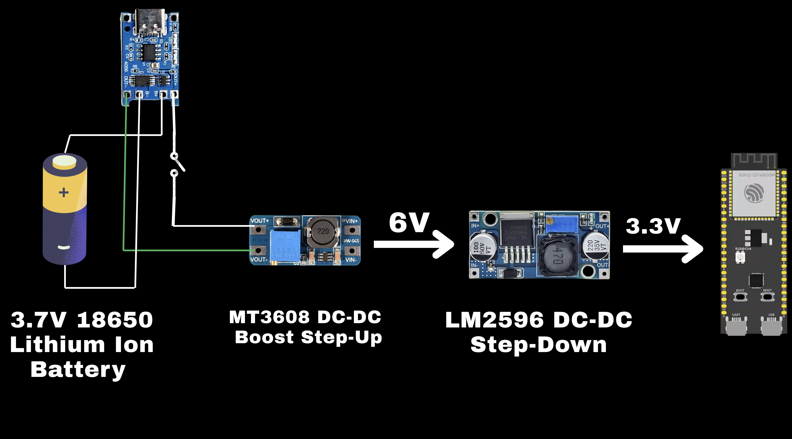

Over three months I built a fully working handheld retro console from scratch — wiring, firmware, and enclosure — around the **ESP32-S3-N16R8**. Every subsystem was hand-assembled: point-to-point wiring on perfboard, off-the-shelf modules, a hand-soldered button matrix, and a 3D-printed shell. The firmware required porting **Retro-Go** — an ESP-IDF multi-emulator launcher — to a target it was never written for. The project earned **Third Place in the Engineering Track at NU UGRF 20th Edition**.

First run of the system:

<video controls autoplay muted loop playsinline width="100%">
  <source src="./first.mp4" type="video/mp4">
</video>

## SoC selection

The core is the **ESP32-S3-N16R8** — dual-core Xtensa LX7 at up to 240 MHz, 16 MB octal-SPI flash, 8 MB octal-SPI PSRAM on the same package. Three things made it the right fit:

**Dual-core task pinning.** Core 0 runs the emulator tick and audio mixing. Core 1 handles the display DMA transfer and input scanning. Separating these eliminates the scheduling jitter that causes audio glitches or dropped frames when everything competes on one timeline.

**External PSRAM.** On-chip SRAM is 512 KB — not enough to hold a 320×240 RGB565 framebuffer (150 KB) alongside ROM working memory. The 8 MB octal PSRAM, accessible at ~80 MHz via the dedicated MSPI bus, provides the headroom without requiring any swapping.

**DMA-capable SPI.** The SPI2/SPI3 controllers support DMA-linked descriptor chains. A full frame transfer is triggered once and completes without CPU involvement, which is what makes 30+ FPS achievable.

## Hardware: modules and hand-wiring

The build uses off-the-shelf modules wired point-to-point on perfboard, housed in a 3D-printed enclosure:

| Component | Module | Interface |
|---|---|---|
| 3.2″ ILI9341 TFT (320×240) | Pre-made SPI display board | SPI + DMA |
| SD card reader | Breakout module | SPI (shared bus) |
| Button matrix (8 keys) | Hand-soldered on perfboard | GPIO rows/cols |
| Audio amplifier | I2S Class-D module | I2S |
| Power regulation | MT3608 boost + LM2596 buck | — |
| Battery charging | TP4056 USB-C module | — |

## Power supply design

The power chain uses a two-stage conversion from an **18650 LiPo cell** (3.7 V nominal, 3.0–4.2 V across the discharge curve):

An **MT3608 DC-DC boost converter** first steps the battery voltage up to a fixed **6 V**. That regulated 6 V feeds an **LM2596 DC-DC buck converter**, which steps it down to a stable **3.3 V** for the ESP32-S3 and all peripherals.

The reason for boost-then-buck rather than a direct buck from 3.7 V: a buck converter requires its input to be higher than its output by the dropout margin. As the 18650 discharges toward 3.0 V, a direct 3.7→3.3 V buck loses regulation and browns out. By boosting to 6 V first, the LM2596 always has sufficient headroom to hold 3.3 V flat across the entire battery life.

Charging is handled by a **TP4056-based USB-C module** that feeds the 18650 directly, independent of the boost converter. A power switch on the battery output line gates the rest of the circuit.

## Porting Retro-Go to the ESP32-S3

**Retro-Go** is an ESP-IDF multi-emulator launcher with native support for the ESP32 and ESP32-WROVER. The ESP32-S3 is not a supported target — its GPIO matrix, peripheral base addresses, PSRAM controller, and Kconfig surface differ enough that the existing firmware would not boot. The port required rebuilding the hardware abstraction layer from the ground up.

### Target definition and build system

Retro-Go uses board-specific headers gated by Kconfig. Adding the ESP32-S3-N16R8 required:

1. A new `sdkconfig.defaults` with the correct flash size (16 MB), PSRAM mode (octal), and PSRAM clock (80 MHz).
2. A `board.h` mapping every logical pin name (`LCD_CS`, `LCD_DC`, `LCD_RST`, `SD_CS`, `BTN_*`, `I2S_*`) to the physical GPIO numbers on my wiring.
3. Enabling `CONFIG_ESP32S3_SPIRAM_SUPPORT`, `CONFIG_SPIRAM_MODE_OCT`, and cache-through PSRAM access so that `heap_caps_malloc(MALLOC_CAP_SPIRAM)` allocates into external RAM without faulting.

### Display pipeline: SPI, DMA, and framebuffer

The ILI9341 runs on SPI2 at 40 MHz with a dedicated DMA channel. The pipeline per frame:

1. Emulator core writes a completed frame into a PSRAM-backed framebuffer (320×240×2 = 150 KB).
2. A display task on Core 1 detects the frame-ready flag, issues the ILI9341 column/row address window commands over SPI, then kicks off a DMA transfer of the entire buffer via a single linked-list descriptor.
3. The DMA completion ISR clears the flag and signals Core 0 that the buffer is free.

The ILI9341 initialization sequence required careful attention: the controller needs `SLPOUT → COLMOD → MADCTL → DISPON` with specific inter-command delays, and any deviation produces a black screen or color corruption. Getting this right took several iterations cross-referencing the datasheet against the logic analyzer traces on the SPI lines.

PSRAM cache alignment also mattered: octal PSRAM on the ESP32-S3 has 64-byte cache lines. Framebuffer writes that cross a cache line boundary generate extra bus transactions. Aligning the buffer to 64 bytes and writing in row-major order eliminated the excess traffic.

### Input: matrix scanning and debounce

The button matrix is 4 rows × 2 columns (8 keys). A 10 ms timer ISR on Core 1 scans it:

1. Pull each row low in sequence.
2. Sample the column GPIO states.
3. XOR current sample against previous to detect edges.
4. Commit an edge to the event queue only after it holds stable for two consecutive scans (20 ms total) — a simple counter-based debounce.

The resulting key-down/key-up event stream feeds into Retro-Go's input layer, which translates it to the per-core button bitmask each emulator expects.

### Storage and ROM loading

The SD card shares the SPI2 bus with the display, with chip-select arbitration preventing bus conflicts. It is formatted FAT32 and mounted via `esp_vfs_fat_sdspi_mount`. At boot the launcher walks `/roms` with `readdir`, builds an in-memory title list grouped by system, and renders the menu. ROM data streams into PSRAM during emulator init rather than fully buffering at load time, keeping load times under two seconds for most titles.

### Audio

The I2S peripheral runs in master TX mode at 22 kHz, 16-bit mono. Emulator cores write samples into a FreeRTOS ring buffer; a dedicated task drains it into the I2S DMA TX FIFO. The ring buffer is sized at 1024 samples (~46 ms latency) — enough to absorb worst-case emulator timing variance without audible lag.

With all four subsystems stable — display, input, storage, audio — the NES, Game Boy, and Sega Master System cores ran at full speed with no frame drops.

## Engineering presentation and award

The project was submitted to the **20th NU Undergraduate Research Forum**, Egypt's largest national undergraduate research competition. The presentation covered the full system end-to-end: the power regulation chain, wiring and signal integrity, SPI/DMA pipeline architecture, HAL porting methodology, input debounce design, FAT filesystem integration, and PSRAM memory layout. Judges asked specifically about the boost-then-buck power decision and the DMA descriptor chain design — being able to explain the *why* behind each decision, not just that it worked, is what separated this from other embedded projects.

The full project — firmware source, wiring notes, and configuration — is open source.

GitHub repo: **https://github.com/AshrafHanyy/GameBoy-ESP32-S3**