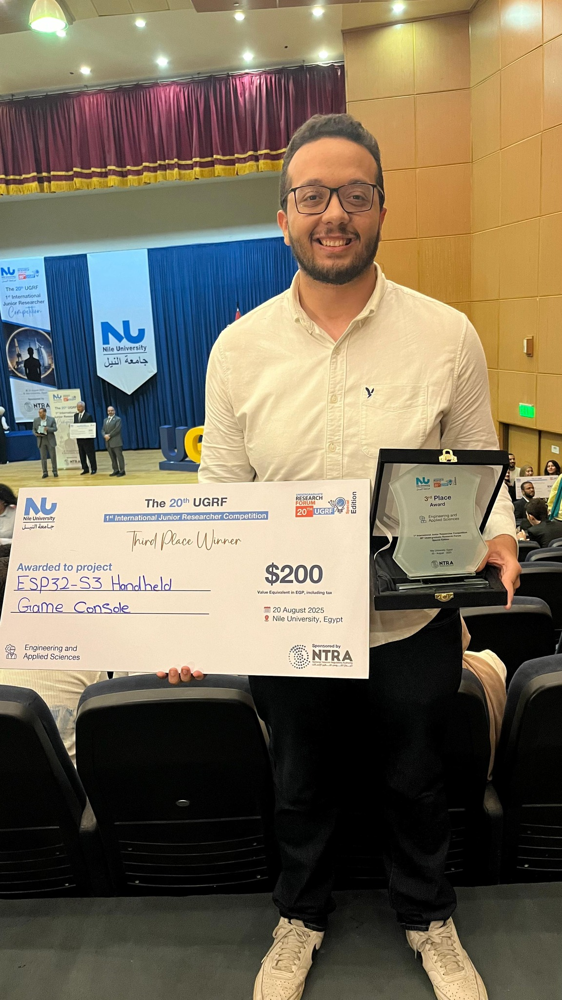

Over three months I designed and built a fully working handheld retro console from the ground up — circuit, firmware, and enclosure — around the ESP32-S3. What began as a personal challenge turned into an end-to-end hardware–software engineering project that earned **Third Place in the Engineering Track at NU UGRF 20th Edition**.

First run of the system:

<video controls autoplay muted loop playsinline width="100%">
  <source src="./first.mp4" type="video/mp4">
</video>

## Why the ESP32-S3

The console is built around the ESP32-S3, a dual-core Xtensa LX7 SoC clocking up to 240 MHz. Two factors drove the choice: the second core lets emulation, display refresh, and input polling run concurrently instead of fighting for a single timeline, and external PSRAM support gives enough headroom to hold framebuffers and ROM data without starving the on-chip SRAM. Its DMA-capable SPI peripheral was the other deciding factor — it's what makes pushing full frames to the display cheap enough to hit playable frame rates.

The hardware around the SoC is all custom:

- A 3.2-inch TFT display driven over SPI
- A custom-wired SD card reader for ROM storage
- A fully hand-assembled button matrix for input
- An I2S-driven Class-D audio path
- A custom PCB tying it together, housed in a 3D-printed enclosure

## Porting Retro-Go to an unsupported SoC

The software is based on **Retro-Go**, an ESP-IDF multi-emulator launcher — but the ESP32-S3 isn't one of its native targets, so the firmware had to be rebuilt rather than flashed. The bulk of the work lived in the hardware abstraction layer: defining a new target profile, remapping every GPIO to match my PCB, and rewriting the board configuration so the build system knew what it was running on.

The display brought the hardest problems. Getting smooth output meant configuring the SPI bus for DMA transfers so frame pushes didn't block the CPU, matching the display controller's initialization sequence and timing, and managing the framebuffer in PSRAM. Anything misaligned here shows up immediately as tearing, color corruption, or a stalled frame loop, so this was the part that took the most iteration on the logic analyzer.

Input was a parallel effort: scanning the button matrix and debouncing it into the clean, low-latency event stream the emulators expect, then wiring those events into Retro-Go's input layer. Storage tied the system together — ROMs are read from the SD card over SPI through a FAT filesystem, with the launcher enumerating titles at boot. Once the display, input, storage, and audio paths were all stable, the NES, Game Boy, and Sega cores ran at full speed.

## Communicating the engineering

A big part of the project was preparing and delivering a **detailed engineering presentation** that traced the device end to end: the electrical wiring and power, display timing and the SPI/DMA pipeline, the input matrix and event handling, the firmware and HAL architecture, SD/FAT integration, and the specific challenges of bringing Retro-Go up on an unsupported microcontroller. Being able to articulate *why* each design decision was made — not just that it worked — is what carried the award.

This project taught me more about embedded systems, hardware bring-up, SPI/DMA debugging, and low-level optimization than any course has. And the entire design — firmware, configuration, and notes — is open source.

GitHub repo: **https://github.com/AshrafHanyy/GameBoy-ESP32-S3**