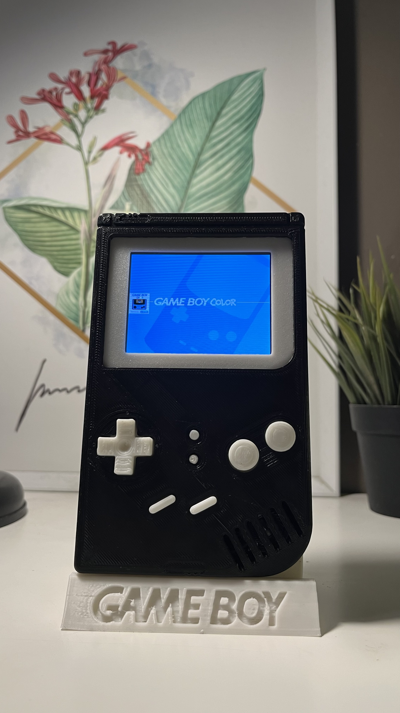
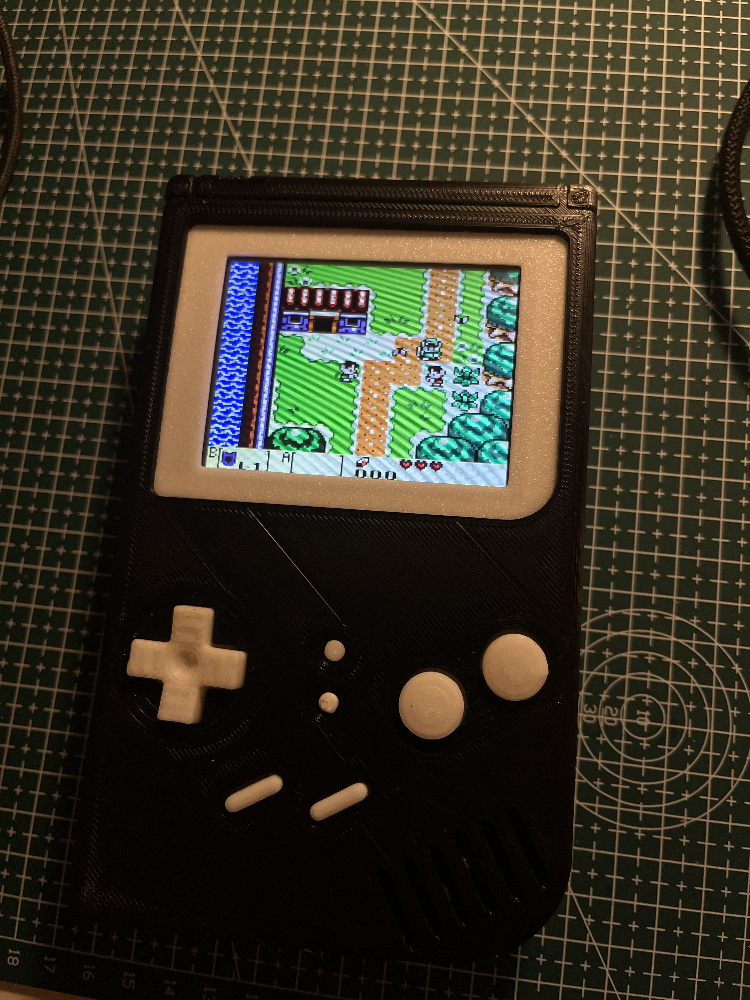
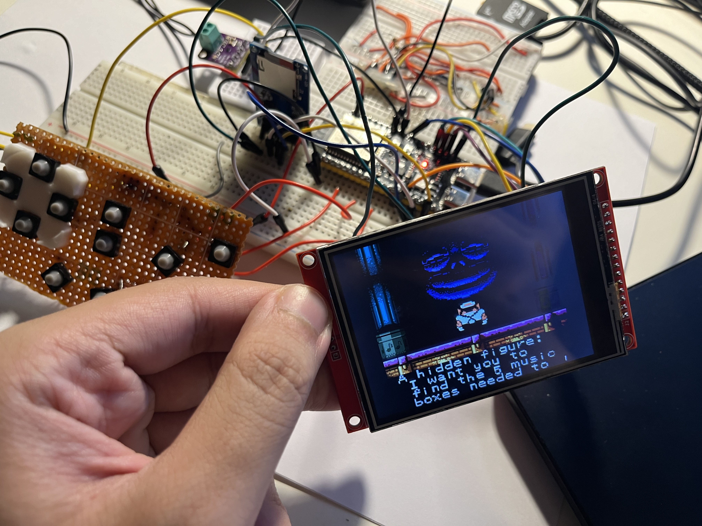
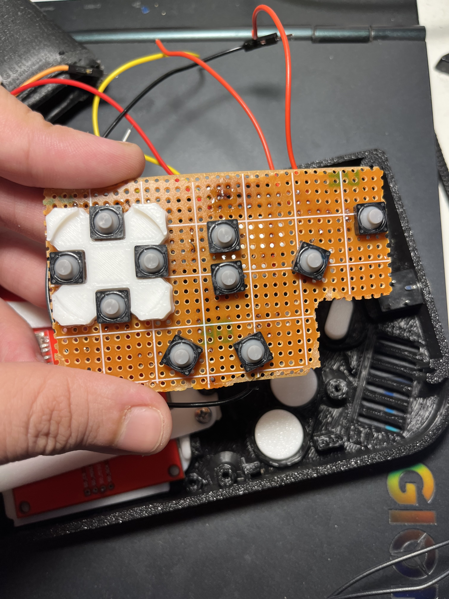
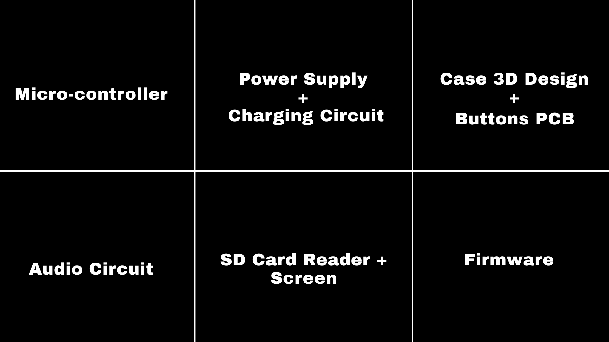

Over the past three months, I built something I’ve dreamed of since childhood — **a fully working custom Game Boy**, developed from scratch using the **ESP32-S3**. What started as a personal challenge quickly grew into a full hardware–software engineering project, earning **Third Place in the Engineering Track at NU UGRF 20th Edition**.

The project is powered by the ESP32-S3 microcontroller, chosen for its dual-core performance, low power consumption, and strong support for display and peripheral interfaces. The build incorporates:

- A **3.2-inch TFT display**
- A custom-wired **SD card reader**
- A fully hand-assembled button matrix
- Custom PCB wiring and a 3D-printed enclosure

I based the software on **Retro-Go**, but because the ESP32-S3 is not supported natively, the firmware had to be **rebuilt and reconfigured from scratch**. That included adapting display drivers, redefining hardware mappings, and tailoring configuration files so everything—from frame rendering to input polling—worked smoothly on the new hardware.

One of the highlights of the journey was preparing and delivering a **detailed engineering presentation** that broke down every component of the device: electrical wiring, display timing, input mapping, firmware architecture, SD file system integration, and the challenges of adapting Retro-Go to a new microcontroller. This presentation played a big role in communicating the complexity of the work and contributed to winning the award.

This project taught me more about embedded systems, debugging, hardware design, and low-level optimization than any course ever has. And best of all — I open-sourced everything.

GitHub repo: **https://github.com/AshrafHanyy/GameBoy-ESP32-S3**
