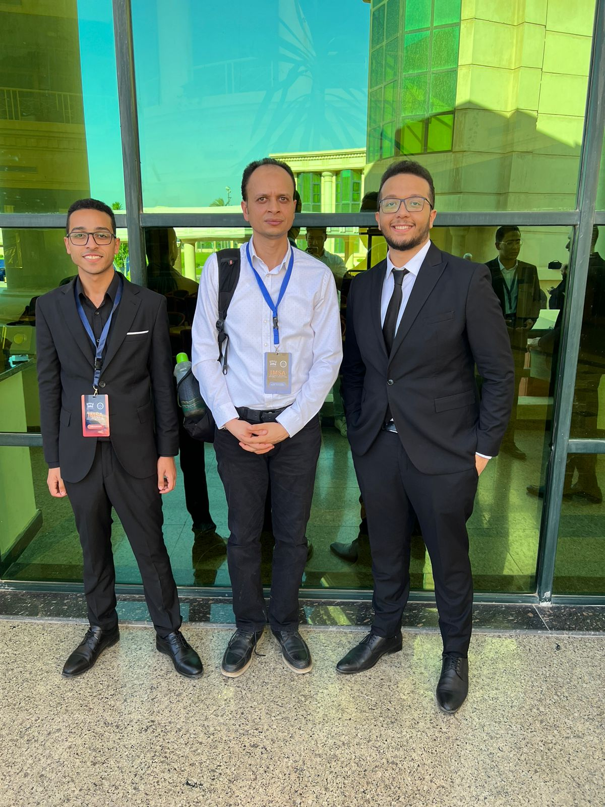

This has to be my most not-so-humble accomplishment that I've achieved during my four years of university. 

I want this blog post to be a place where the story of how I founded this club is shared publicly for the first time. In order to start telling this story from my point of view, let's go back in time to before the beginning of the Fall 2022 semester. 

# Pre-Fall 2022

Over the summer break, one of my close friends studying computer science at NU shares his certificate after participating at the ECPC. I saw the ICPC logo and I recognize that from some  popular YT videos I saw of people solving problems online and saying it's for the ICPC. I send him asking what's the story behind this certificate, he tells me all about the ECPC, that it's held annually, that he is able to participate with a club that has been established for many years at his university.

I immediately check the list of clubs my university offers students, only to find out that the ICPC community club at my university simply doesn't exist. This makes me wonder if I even picked the right computer science school. I was and still very much am, deeply disappointed that no one cared to establish such a club or train the students to participate at the ECPC on a large scale before.

It was sad to see that in order to participate, I would have to first make this competition a known thing and try to market it first since no one knew what this was. I was told that there was a single TA that trained students before and participated, but she left like 3 years ago after participating for 2 consecutive years.

# Fall 2022

First week of the semester, and what do I do? I schedule a meeting with the vice-dean.

On the day of the meeting, first time talking to him, I told him how we need to participate at the contest and that almost all of the schools that taught computer science across the republic participated and it's very bad that we didn't. He welcomed the idea fiercely. He told me that there was another senior student, Mohamed Alaa, that asked for the same idea to be implemented before but for some reason they didn't follow through. He then asked me if I could, after contacting Alaa, gather some students for this initiative to start. I told him I could but who would give the training? 

He suddenly stood up and then asked me to come with him. We walked to an office, knocked and he entered to Dr. Islam ElSharaawy. This was the first time I met Dr. Islam. Dr. Islam was known to be the smartest engineer to ever step foot on campus.

The vice-dean then continued to greet him and told him about my idea to participate. Dr. Islam welcomed the idea and said he could provide the training. 

And so we did, Alaa and I became the president and the vice president of the community, respectively. And we gathered over a 100 student to begin the training. 

# Spring 2023

Throughout the first year, the training was very chaotic and very disorderly, Due to the fact that the instructors didn't have that much time to plan effectively for the sessions and the students themselves were not highly motivated or committed. 

The community grew step-by-step. But since this was the first year for this to take place. No one knew what this was. 

The registration for the ECPC begin in May, Alaa took care of almost everything regarding the registration.

Eventually, we ended up participating at the ECPC 2023!

# Fall 2023

The start of a new academic year, or as we call it in CPC, Season 2. 

Alaa had graduated. And now, I was alone. Tasked to convert the community to an official student activity (a club). This involved a lot of tasks that I had no experience in. I had to recruit students to handle our branding & media, hire a graphic designer to create our logo, draft all the required papers and have them signed, develop a training a plan with Dr. Islam and most importantly, recruit a new vice president. 

For the logo, I hired a professional graphic designer who was a friend. He did an okay job.

For our media, I knew a classmate who was the head of media at a very prestigious club at the university. I called him and he agreed. Later on, he founded our visual identity, later on, the whole media team at our club did the best coverage possible. They all did so great.

For our training plan, I let Dr. Islam handle that.

For the vice president, I heard about this senior student who was known to be very good at organizing events. I called her and luckily she agreed. Later on, I found out that this was the worst decision I could have ever made as she was always busy with her graduation project and rarely provided input.

All done, I submitted the papers to the student activities department and a week later I got a notification that our community is now an official club at the university.

# Fall 2023