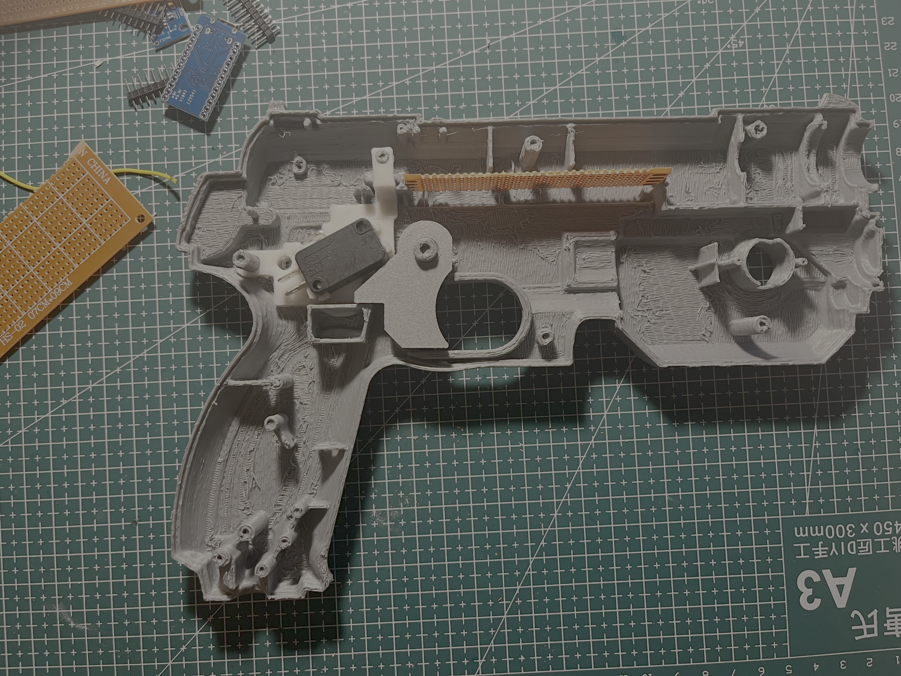
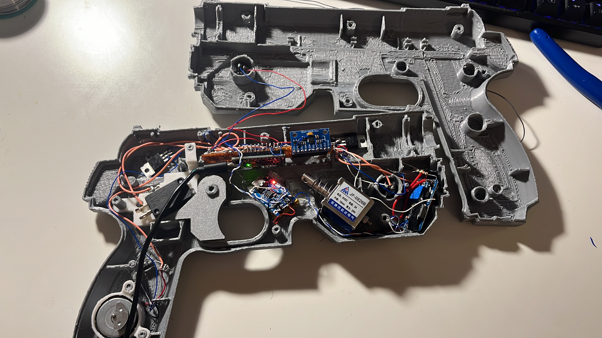

In early July of 2025, I decided to take on a project that sat right at the intersection of **nostalgia, hardware hacking, and software experimentation** — building a **motion-controlled light gun** from scratch.

Not a USB toy, not a commercial controller — but a fully custom-built gun that translates real-world motion into **mouse movement**, designed to work with PC games. Every part of it, from the electronics to the calibration logic, was built and tuned by hand.

---

## The Idea

Classic light guns relied on CRT displays, which made them almost useless in the modern LCD era. Instead of trying to replicate old-school optical detection, I wanted something different:

- A gun that **tracks motion**
- Feels physical (real trigger, real kick)
- Behaves like a mouse, so it works with *any* PC game
- Starts centered on screen and stays controllable

That’s where **IMU-based tracking** came in.

---

## Hardware Overview

The core of the build revolves around a few key components:

- **Arduino Pro Mini** – compact, reliable, and easy to embed
- **MPU6050** – 6-axis IMU (accelerometer + gyroscope)
- **Solenoid** – for recoil feedback on trigger pull
- **MOSFET + flyback diode** – to safely drive the solenoid
- **Custom trigger switch**
- **3D-printed enclosure**, shaped like a pistol grip

All electronics were mounted inside the shell with zero PCBs — everything is point-to-point wired and secured manually.

<video controls autoplay muted loop playsinline width="100%">
  <source src="./LIGHTGUN.mp4" type="video/mp4">
  Your browser does not support the video tag.
</video>

The solenoid was a must. I didn’t want this to feel like clicking a mouse — I wanted **mechanical feedback**. When the trigger is pulled, the solenoid snaps back instantly, giving a sharp recoil that makes the whole thing feel alive.

---

## Motion Tracking with MPU6050

The MPU6050 handles all orientation and movement sensing. Rather than relying on absolute position (which IMUs are terrible at), the system tracks **angular velocity** and integrates it into smooth cursor movement.

Key challenges here:

- Gyro drift
- Noise from small hand movements
- Sensitivity tuning so aiming feels natural

To deal with this, I implemented:
- Gyroscope bias calibration at startup
- Dead zones for micro-movements
- Adjustable sensitivity scaling

The result is motion that feels responsive without being jittery.

---

## Turning Motion into a Mouse

On the Arduino side, the gun streams processed motion data over serial. On the PC side, I wrote a **custom calibration and mapping program** that:

- Starts the cursor **locked to the center of the screen**
- Converts angular motion into relative mouse movement
- Applies smoothing and gain curves
- Allows recalibration without restarting

This software layer was critical. Raw IMU data alone doesn’t feel good — the calibration logic is what makes the gun *usable*.

Once dialed in, the gun behaves just like a mouse — which means it works with:
- FPS games
- Emulators
- Target-shooting games
- Any application that accepts mouse input

---

## Internal Layout

Here’s a look inside the gun before closing it up:

It’s messy in the way all real prototypes are — wires routed by necessity, hot glue where screws wouldn’t fit, and components packed tighter than planned. But everything i
