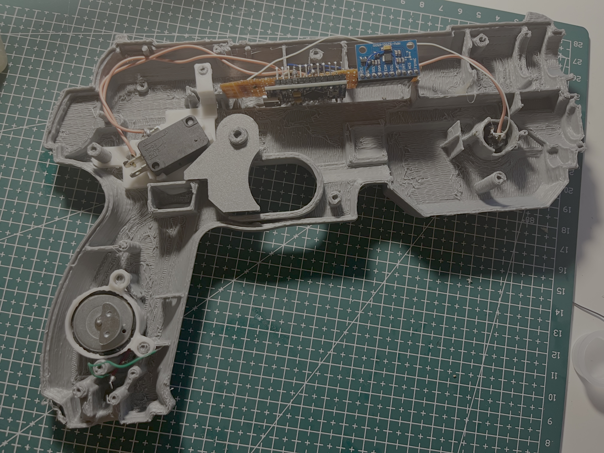
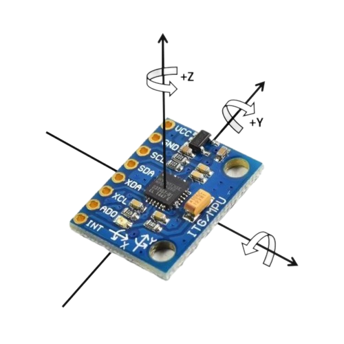
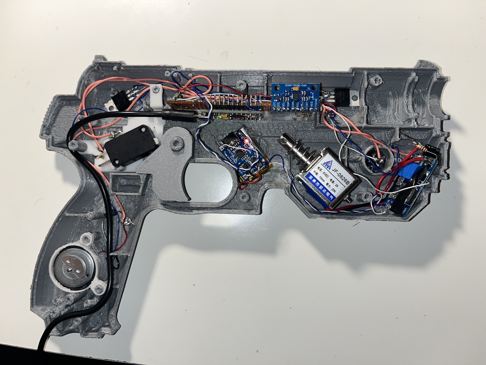

Right after finishing the ESP32-S3 Game Boy, I wanted to build something that sat at the intersection of hardware and software in a different way — a motion-controlled light gun, built from scratch, that works with modern PC games. Not a toy, not a commercial controller. A fully custom build that translates physical gun movement into mouse input, complete with mechanical recoil on every trigger pull.

---

## Why IMU Instead of IR

Classic light guns from the CRT era worked by detecting the brief flash of phosphor on the screen at the exact moment the electron beam swept past the gun's optical sensor. That technique is physically impossible on modern LCD and OLED displays — there is no beam, no phosphor flash.

Most modern DIY light gun projects solve this by pairing a camera with an IR LED bar: the camera tracks the position of the IR sources and derives absolute screen coordinates from their positions. This is how the Wiimote's pointing works. It's accurate and drift-free, but it requires a dedicated IR position sensor (typically a Wii sensor bar camera module).

Without that camera available, I went a different route: **gyroscope-based relative tracking**. The gun tracks *how much it has rotated* since the last calibration point, and maps that rotation to mouse movement. This avoids the IR hardware dependency entirely, at the cost of requiring periodic recentering.

<video controls autoplay muted loop playsinline width="100%">
  <source src="./IMG_7515.mp4" type="video/mp4">
</video>

---

## The 3D Printed Shell

The enclosure is a 3D printed two-part shell based on a scanned PS1CON STL model — a pistol-shaped case with internal cavities designed to hold electronics. It prints in two halves that clip together, with dedicated pockets for the trigger mechanism, solenoid, and main board.

The internal layout was dictated by the shell geometry. The solenoid sits in the center of the body where it has room to actuate. The MPU6050 mounts in the upper slide section, as far from the solenoid's vibration as the shell allows. The Arduino Pro Micro and MOSFET board sit in the grip area, and the microswitch trigger lines up with the trigger guard opening.

All components are wired point-to-point and secured with hot glue. There is no PCB — everything is hand-wired inside the shell.

---

## Electronics

**Arduino Pro Micro (ATmega32U4).** The main controller. The ATmega32U4 has native full-speed USB, which means it shows up as a real serial device without an FTDI adapter. It reads the MPU6050 over I2C, reads the trigger microswitch on a digital input, and streams processed motion data to the PC over USB serial. All motion-to-mouse translation happens on the PC side.

**MPU6050.** A 6-axis MEMS IMU — 3-axis accelerometer and 3-axis gyroscope on a single chip, communicating over I2C. The gyroscope measures angular velocity on three axes (pitch, yaw, roll) in degrees per second.

For this application, only two axes matter:
- **Pitch** (tilting the barrel up/down) → vertical mouse movement
- **Yaw** (rotating the gun left/right) → horizontal mouse movement

Roll is ignored. The gyroscope output is read at a fixed interval and the angular velocity is integrated over time to produce a cumulative angle delta, which maps to a relative mouse displacement on the PC.

**JF-0826B Solenoid.** A push-type solenoid rated at **6VDC, 2A, 20N force**. When the trigger is pulled, the solenoid fires and its plunger snaps back sharply — producing a physical recoil kick. At 20N and 2A draw, it hits hard enough to feel realistic but won't stall out under the spring return load.

**Power supply — two independent rails.** The Arduino Pro Micro is always powered via the USB-C cable that also carries the serial data to the PC. The solenoid runs on a completely separate rail: a **250mAh LiPo cell** with a dedicated USB-C charging module, mounted inside the shell. Keeping the solenoid power isolated from the USB rail is important — the JF-0826B pulls 2A on trigger, a spike large enough to droop a shared supply and potentially reset or glitch the Arduino mid-session.

**MOSFET driver module + flyback diode.** The solenoid draws 2A — far beyond what an Arduino GPIO pin can source (40mA maximum). A MOSFET module switches the solenoid load from the LiPo battery, controlled by a digital Arduino pin. A flyback diode across the solenoid clamps the inductive voltage spike that occurs when current is cut, protecting the MOSFET from the reverse EMF.

**Microswitch trigger.** A small momentary microswitch is mounted behind the trigger guard, actuated by the physical trigger on the 3D print. It connects to a digital input pin on the Arduino with the internal pull-up enabled — pressing the trigger pulls the pin low.

---

## Motion Tracking: Gyroscope Integration and Drift

The fundamental challenge with gyroscope-based tracking is **drift**. A gyroscope measures angular velocity, and to get position you integrate that velocity over time. Any small constant error in the measured angular velocity accumulates into a growing position error — the cursor will slowly drift even if the gun is perfectly still.

Three measures address this:

**Bias calibration at startup.** When the gun is powered on and held still, the firmware samples the gyroscope for several hundred milliseconds and computes the average reading on each axis. This average is the *bias* — the non-zero offset the sensor reports even with zero real rotation. It is subtracted from every subsequent reading before integration.

**Dead zone.** Angular velocity readings below a threshold (a few degrees per second) are treated as zero and contribute nothing to the integrated position. This prevents the cursor from slowly drifting due to noise and very small hand tremors. The threshold is tunable to match how steady the user holds the gun.

**Recalibration.** Since gyro drift is unavoidable over long sessions, the PC software supports instant recentering — pressing a button snaps the cursor back to the center of the screen and resets the accumulated angle. This is the same pattern used by joystick-based "mouse look" in games.

---

## PC Software: Serial to Mouse

The Arduino does not emulate a mouse directly. It streams raw processed angle deltas over USB serial to a custom PC application, which is responsible for all the mouse movement.

The PC software:
- Opens the serial port and reads angle delta packets from the Arduino
- Maintains a running cursor position, initialized to the center of the screen
- Converts each angle delta to a pixel displacement using a configurable sensitivity multiplier
- Applies a smoothing curve so fast movements are responsive but fine aiming isn't jittery
- Calls the OS mouse movement API to move the cursor by the computed delta
- Supports recalibration (center-lock reset) without restarting

Because the gun outputs relative mouse movement through the OS, it is compatible with any PC application that reads mouse input — FPS games, emulators, browser games, anything.

---

## Result

<video controls autoplay muted loop playsinline width="100%">
  <source src="./LIGHTGUN.mp4" type="video/mp4">
</video>

<video controls autoplay muted loop playsinline width="100%">
  <source src="./IMG_7397.mp4" type="video/mp4">
</video>

The gun tracks smoothly, the solenoid recoil is sharp and satisfying, and the cursor stays controllable across a full gaming session with occasional recentering. Drift is present but manageable — bias calibration handles startup offset, and the dead zone keeps the cursor from wandering during still aiming. The biggest remaining limitation is long-session drift, which IMU-only tracking cannot fully eliminate without an absolute position reference.
