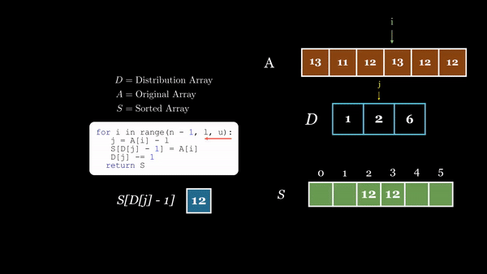

## Learning Manim

In this blog post, I'll share my experience learning **Manim**, a mathematical animation engine, and how I used it to develop two videos. One focused on the **Distribution Counting Sort** algorithm, and the other on **Neural Networks and Activation Functions**.

## Distribution Counting Sort Visualization

The **Distribution Counting Sort** algorithm is an efficient sorting technique designed specifically for integers with a limited range. It works by counting the occurrences of each element and using those counts to determine the correct positions of the elements in the sorted array.

I developed this visualization as part of my **Design and Analysis of Algorithms course (CS312)**. Over the course of **78 hours**, I created it using **Manim** and polished the final video with background music using **Adobe Premiere Pro**.

### Watch the Video

[Click here](https://www.youtube.com/watch?v=TVK_2h5Q1Sc&t) to watch the video.

### Technical Details
For this animation, luckly, I foundy a ready-made library named `manim_data_structures` that allowed me to show the arrays easily. I used the examples from Levitin's algorithms book to create the animation in the video. 

#Create array from levitin
arr = MArray(
    self,
    [13, 11, 12, 13, 12, 12],
    mob_square_args={'fill_color':  DARK_BROWN,'color': WHITE},
    mob_value_args={'color': WHITE,'font_size':28},
    mob_index_args={'color': WHITE},
    mob_arr_label_args={'color': WHITE},
    label='A',
    hide_index=True
)    

You can find the full source code on [GitHub](https://github.com/AshrafHanyy/Distrubtion_Count_Sort).
---
## Neural Networks & Activation Functions

For the machine learning course taught at the university with Dr. Ammar Mohamed, I wanted to visualize the process of learning for neural networks and activation functions to better understand it. I think this has to be the better animation that I personally perfer out of the two. 

### Watch the Video

[Click here](https://www.youtube.com/watch?v=9wMVz_UphlE) to watch the video

### Code
The code was a bit tricky for this one, because 

###########################
#Creating Neural Network (Code Written by Ashraf Hany)
###########################
circleslayer1 = VGroup(
    
    Circle(radius=0.95, fill_color=BLACK, stroke_color=WHITE, fill_opacity=1),
    Circle(radius=0.95, fill_color=BLACK, stroke_color=WHITE, fill_opacity=1),
    Circle(radius=0.95,fill_color=BLACK, stroke_color=WHITE, fill_opacity=1),
    Circle(radius=0.95, fill_color=BLACK, stroke_color=WHITE, fill_opacity=1),
    Circle(radius=0.95, fill_color=BLACK, stroke_color=WHITE, fill_opacity=1),
    Circle(radius=0.95, fill_color=BLACK, stroke_color=WHITE, fill_opacity=1),
    Circle(radius=0.95,fill_color=BLACK, stroke_color=WHITE, fill_opacity=1)
).arrange(DOWN,center = True, buff=0.55).shift(5.5*LEFT + UP * 0.25).scale(0.5)
circleslayer2 = VGroup(
            Circle(radius=1, fill_color=BLACK, stroke_color=WHITE, fill_opacity=1),
            Circle(radius=1, fill_color=BLACK, stroke_color=WHITE, fill_opacity=1),
            Circle(radius=1, fill_color=BLACK, stroke_color=WHITE, fill_opacity=1),
            Tex(r"\textbf{...\\...}",font_size= 55),
            
            Circle(radius=1,fill_color=BLACK, stroke_color=WHITE, fill_opacity=1)
        ).arrange(DOWN,center = True, buff=0.95).next_to(circleslayer1,8*RIGHT).scale(0.5)
circleslayer3 = VGroup(
            Circle(radius=1, fill_color=BLACK, stroke_color=WHITE, fill_opacity=1),
            
            Tex(r"\textbf{...\\...\\...}",font_size= 55),
            Circle(radius=1, fill_color=BLACK, stroke_color=WHITE, fill_opacity=1),
            Circle(radius=1, fill_color=BLACK, stroke_color=WHITE, fill_opacity=1),
            Circle(radius=1, fill_color=BLACK, stroke_color=WHITE, fill_opacity=1),
            Circle(radius=1,fill_color=BLACK, stroke_color=WHITE, fill_opacity=1)
        ).arrange(DOWN,center = True, buff=0.85).next_to(circleslayer2,8*RIGHT).scale(0.5)

circleslayer4 = VGroup(
            Circle(radius=1, fill_color=BLACK, stroke_color=WHITE, fill_opacity=1),
        ).arrange(DOWN,center = True, buff=0.85).next_to(circleslayer3,8*RIGHT).scale(0.5)

lines = VGroup(*[
        Line(circleslayer1[i].get_center(), circleslayer2[j].get_center(), color=BLUE).set_z_index(-1)
        for i in range(len(circleslayer1)) 
        for j in range(len(circleslayer2)) if j is not 3
    ])

lines2 = VGroup(*[
        Line(circleslayer2[i].get_center(), circleslayer3[j].get_center(), color=BLUE).set_z_index(-1)
        for i in range(len(circleslayer2)) if i is not 3
        for j in range(len(circleslayer3)) if j is not 1
    ])

lines3 = VGroup(*[
        Line(circleslayer3[j].get_center(), circleslayer4[0].get_center(), color=BLUE).set_z_index(-1)
    
        for j in range(len(circleslayer3)) if j is not 1
    ])

linesc = VGroup(*[lines[i]  for i in range(len(lines)) ],
                *[lines2[i]  for i in range(len(lines2)) ],
                *[lines3[i]  for i in range(len(lines3)) ],)

labels= VGroup()
ie=0
for node_index, node_object in enumerate(circleslayer1):
    location = node_index * 0.99
    node_object = MathTex(f"x_{ie}",font_size=48,substrings_to_isolate="x")
    node_object.set_color(WHITE)
    node_object.set_color_by_tex("x",RED)
    node_object.move_to(circleslayer1[node_index].get_center())
    labels.add(node_object)
    ie+= 1

nn2 = VGroup(circleslayer1,circleslayer2,circleslayer3,linesc,circleslayer4,labels)
nn2 = nn2.scale(0.65)
title=Tex("A Multi-layer Feed-Forward Neural Network", font_size = 37, substrings_to_isolate=["Feed-Forward","Multi-layer"])
title.set_color_by_tex("Feed-Forward", RED_B)
title.set_color_by_tex("Multi-layer", BLUE_C)

sr = SurroundingRectangle(nn2[2], corner_radius=0.2)
sr2 = SurroundingRectangle(nn2[1], corner_radius=0.2)

title = title.center()
self.play(FadeIn(title))
self.wait(1)

self.play(title.animate.to_corner(UL).scale(1))
self.play(LaggedStart(
    Create(circleslayer1),
    Create(circleslayer2),
    Create(circleslayer3),
    Create(circleslayer4),
    Create(lines),
    Create(lines2),
    Create(lines3),
      Write(labels)
  ,lag_ratio=0.35))


