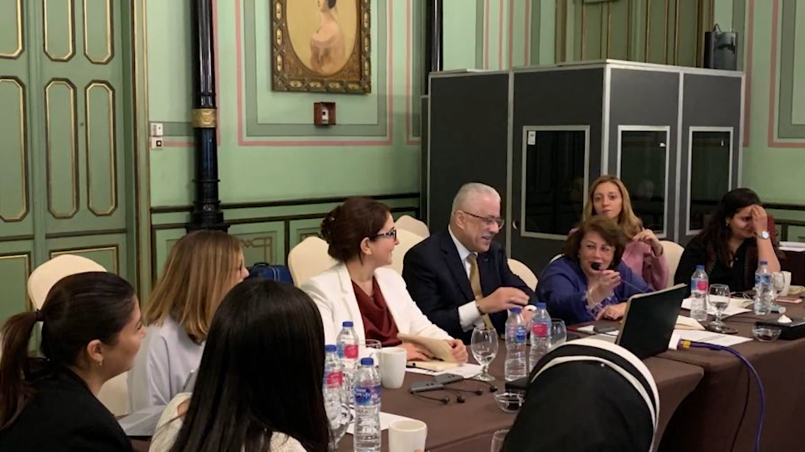
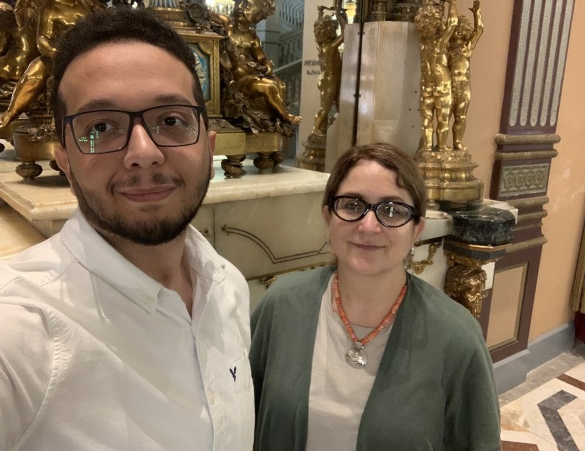
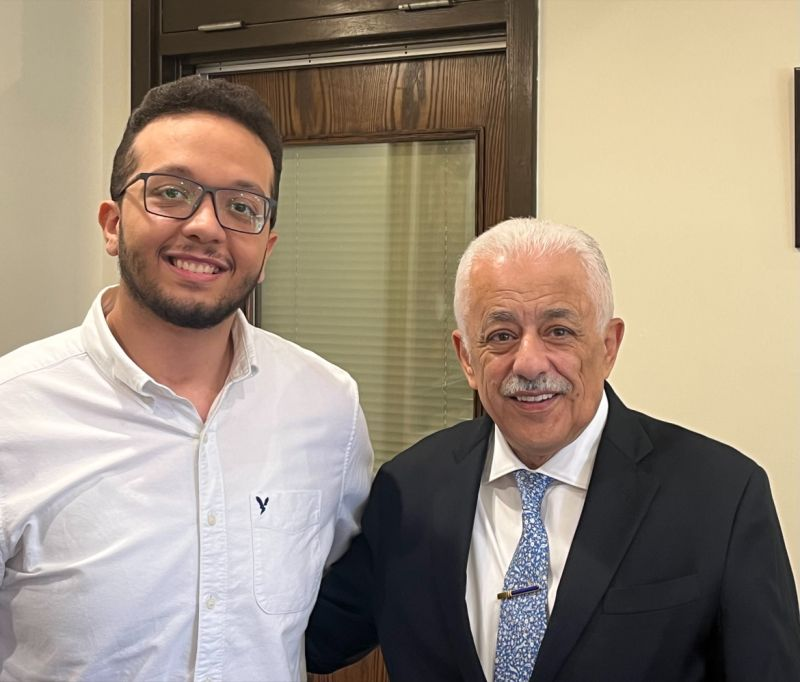

The one thing I obviously never expected when this story first started is that I would meet the former minister of education and someone who I consider a role model in science and in life.

### Education 2.0
On a random day in August 2023, I was scrolling through Youtube when I saw this documentation and research project being done called "The Education 2.0 Research & Documentation Project".

It aimed to document all the education reform the country went through from 2016 up till 2022 (The Regime of Dr. Tarek Shawki as minister). This research included the ministry itself alongside other organizations. And since I was from the first class that went through this reform and was a huge admirer of the new system that changed Thanwya Amma. I liked the idea of documenting it very much, especially since it aimed to document the entire reform so that other developing countries could learn from Egypt's experience in using technology in education.

The social anthropologist, international education advisor, professor of education, and the director of this research, was Dr. Linda Herrera from UIUC. (Sitting on the right of the minister in the picture below).

### The Post

Anyways, I wanted people to know about this and so I posted about it. Telling people to check out this project and provided a link to the Youtube channel. I honestly never expected anything to come out of this post. 

The following day, Dr. Linda sent me a message thanking me for posting about the project. 

It was nice of her that she appreciated such a small gesture. I messaged her back and we talked about the project and I told her that I was Thanwya Amma’s 2018 Class that first went through the new system and then we texted for a while. 

I was honestly excited to talk to her, I had so much to share about all of what happened and thought that I could help her research. Having learnt this, she asked me to do an interview to document my experience from the students POV.

I sure agreed and we arranged a meeting. Two weeks later, she came to Cairo and we actually did the interview.

### The Interview

My interview with Dr. Linda lasted for two hours. I am a huge pshycology reader, and I have my opinions on how the new system affected us as students psychologically and I shared them all with her. We agreed on how most things were, psychologically, for all students. And I can honestly say that talking with an educated anthropologist was, last thing I thought, much needed. Dr. Linda is, by far, the most interesting contact I know to date and I consider myself lucky to have met her. 

I illustrated that there's too much pressure underlying the Thanwya Amma exam. Most students think that if they don't achieve high grades, they will end up in a bad school, then a bad job with a bad salary and eventually will live a miserable life. And since that might be mostly true. It is therefore not the morality of the students whom cheat in that exam that is being questioned but rather it is the exam that is triggering their basic survival instinct. 

Anyways as I don't wish to bore the reader with my full psychological analysis of the situation back then. Let's just say I had some very well formulated opinions.

### First Contact 

Towards the end of the 2 hour long interview, I told her about my research in education. And how that it was inspired by Dr. Tarek's approach to insert technology in education (since my research was about using TUIs in higher education).  I told her that I had always wanted to share these thoughts and opinions with him one day. 

She replied to this saying that she could arrange a meeting, to which I was surprised to say the least, and quickly took out her phone and sent a voice message to Dr. Tarek telling him about me and that she wants to arrange a meeting.

Then she gave me his number and told me to send him a text to arrange the meeting. Needless to say, I was a bit in shock when all of this happened. 

### Meeting The Minister

I actually did end up texting him on Whatsapp that day. Two weeks later I recieved a reply from him. I was super excited as I found myself casually texting the former minister of education and someone who I really admire. He invited me to his office at the AUC. 

On the day of the meeting, I arrived at his office at the AUC and spoke with his secretary. He was finishing up a meeting he had. I was still overwhelmed by the whole situation. I remember how in shock I was when I saw him coming out of the office to greet me. We greeted each other and then went into his office, and started talking. 

Inside the office, we spoke about almost everything. I showed him my research, he spoke about the latest work he saw done in AI to enhance education, we discussed large language models, social conventions, academic conventions, the education reform and the list goes on! 

I remember we kept talking and got lost away in time that his secretary had to enter to remind us that the time we had for the meeting time was up. We then went outside, took the photo and that was it. 

When I look back on all of this, I couldn't possibly believe one day that me scrolling through YouTube and sharing a link would give me a chance to meet him. I'm extremely grateful for Dr. Linda for she was very generous with this opportunity and for Dr. Tarek to make time in his schedule to meet with me. 
