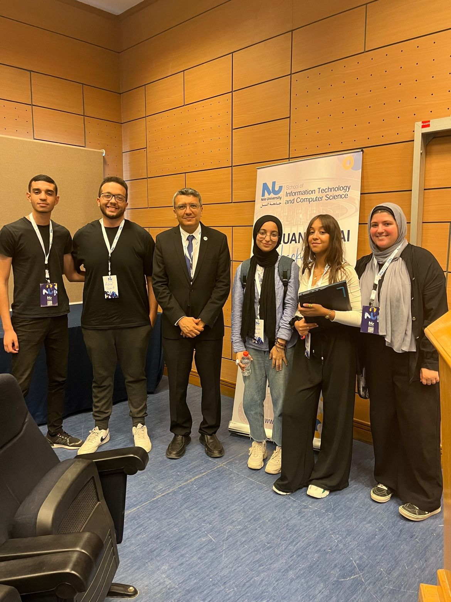
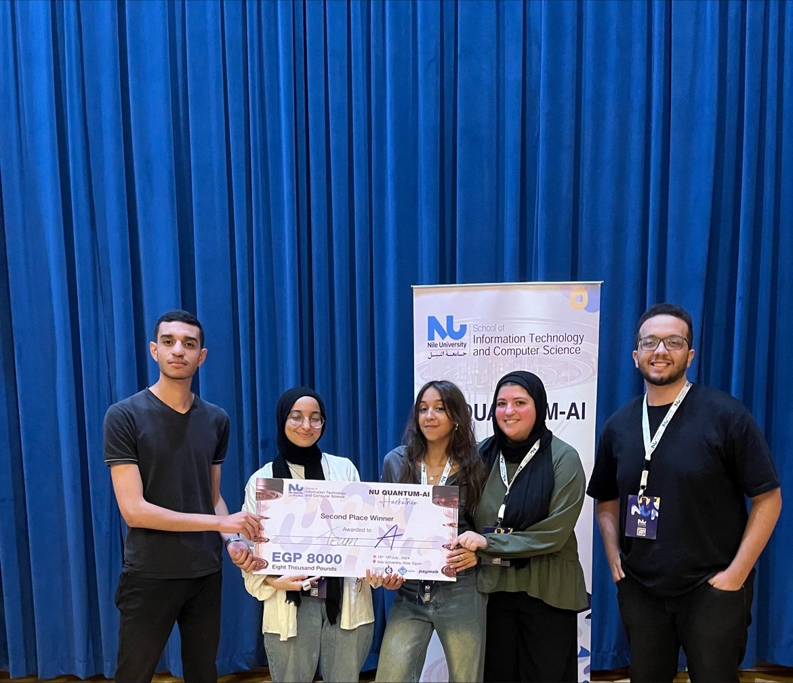

---

title: 'Winning Second Place At Egypt's First Quantum-AI Hackathon'

date: 2024-07-18

summary: 'Our team secured second place in Egypt's first Quantum-AI Hackathon, organized by Nile University!'

authors:

  - admin

tags:

# Display this page in the Featured widget?

featured: true

---

Happy to share that our team secured second place in Egypt's first Quantum-AI Hackathon, organized by Nile University!  
  
The challenge centered on a Raman shift spectroscopy dataset from a recent Nature paper by multiple scholars including an Egyptian scholar and a postdoctoral researcher at Stanford university, Dr. Amr Essawi. We were tasked with preprocessing the data to reduce 1377 features for encoding into a VQC (Variational Quantum Classifier), in addition to building and optimizing the VQC model itself using Qiskit.  

Over two intense days, my team developed and tested around 150 different models, experimenting with various structures and parameters. Our persistence paid off when we achieved a 71% testing accuracy, the second-highest among all teams during the 24-hour period.  
  
This experience gave us a chance to learn more in quantum computing and AI, and I'm proud of what we accomplished. Congratulations to the first-place team who achieved 76% testing accuracy, and thanks to Nile University for hosting this groundbreaking event. And a very special thank you to my teammates who pulled through this hackathon, [Malak Elsamman](https://www.linkedin.com/in/malak-elsamman-860424234/), [Salma Salem](https://www.linkedin.com/in/salma-salem-086281232/), [Rewaa Alaa](https://www.linkedin.com/in/rewaa-alaa-69a50a244/), [Mohammad Emad 🇵🇸](https://www.linkedin.com/in/mohammad-emad-%F0%9F%87%B5%F0%9F%87%B8-67b97a23a/). Without each one of them, the result would have been very different. I’m very grateful to have had the chance to work with them and learn from each other.  
  
Looking forward to seeing how quantum computing continues to evolve in Egypt and beyond.