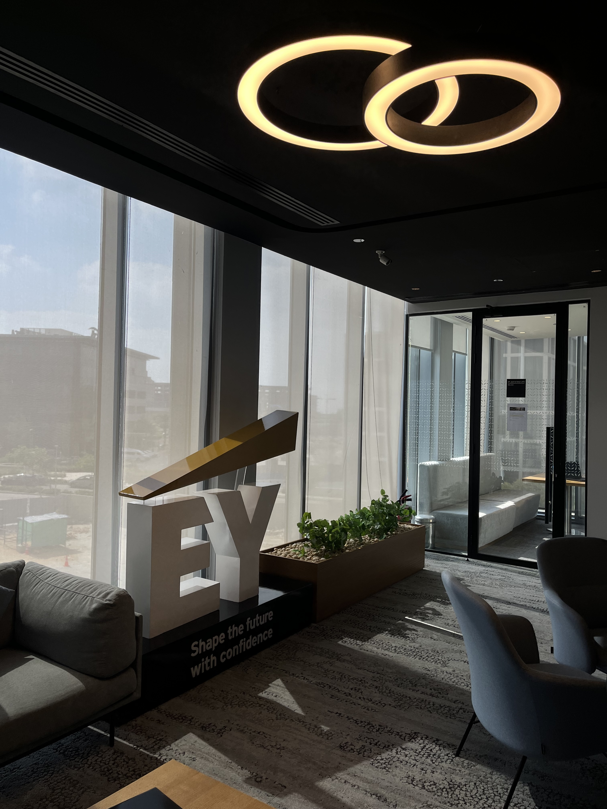

It's been a while since I last wrote a non-technical blog post, but I felt the need to write and share this ever since I saw the graduation posts of the class of 2026.
  
It's been a year since I graduated, I remember I was very excited to graduate back in 2025 but to be honest it has been a roller coaster of events ever since I graduated. Graduating has been an unfriendly event that I am still trying to recover from. I am going to explain the story of everything that has happened to me after graduating, so let's start from August 2025.

## August 2025

After graduating, I was quite worried for what was coming ahead. I knew that the tiny world I had lived in for 4 years and built for myself (as a very convenient comfort zone) would change, if not collapse entirely, but to be honest, I felt the need for that change. It was about time to leave MSA and enter a new era.  

That small world was made of small things mostly. The people I would see every day, the campus I liked staying in after class, the community we built, the research I got to work on. None of it was very big, but it was mine and I always knew exactly where I stood in it. After graduation all of that just stops at once, and you are left with infinite emptiness. A sense of not belonging. 

There were a series of events that took place all at once while I was graduating that made my graduation very rough. 
My classmates were of course gone (but I had to stay as a TA until my military check), so all of the people I saw everyday disappeared from the place. The faculty moved from Building D to a new building K, so all the rooms I spent 4 years at suddenly changed.  Most of the very good professors who shaped my university experience resigned from MSA. The univeristy president, who knew me very well, suddenly passed away as well. These might all be trivial events for anyone, but their timings and their rapid occurrence made it shocking to me to see how quickly the place (physically) you once spent 4 years at and the people (classmates and professors) can disappear all once.

What I was most sad about was that after graduation, was that many of the scientific endeavors I used to love exploring would stop making sense. At the end of the day, for any graduate, any sense of meaning comes from how much money you make, not from how much science you hold. So unless you enter a new entity where you are rewarded for scientific endeavors within that entity, scientific work doesn't really make sense if it doesn't help you achieve certain financial goals. In plain words, any work would be valued by how much money it generates, not by any scientific progress, which was something I used to enjoy doing a lot.

As a student you never have to justify any of it. You can read a paper just because it's interesting, or spend weeks on a problem that will never pay you anything, and nobody asks you why you are doing it. After graduation that question comes up in almost every conversation, and I didn't really have an answer for it yet.

Anyways, I had to do the military medical check in January and could not enter an official position anywhere until after that was done. So, I started working at MSA as a part-time teaching assistant for 3 days per week.

## Life of a Teaching Assistant (September – January)

As a TA, things are quite different. You can't really do most of the things you can do freely as a student, there is always the responsibility of having to be the bigger person, always.

It is also strange being in the same place with a different title, different building, different corridors and different halls. You can't complain about a course out loud anymore. And the students treat you like you were always on that side of the desk, they have no idea you were sitting exactly where they are sitting a month ago.

And I can't begin to explain how lonely it was after my class graduated and left. Most of my friends got into the military or traveled abroad.

This was quite a lonely period where I couldn't work at a new place because of my military status, so I couldn't meet new people there either, and at the same time I couldn't meet the people I used to know here since they all left after graduation. So most days were the same, I would go to campus, do my work, and go home. The place was full of people I didn't know. And And what made this period worse was that I had fallen out with a few people who were very close to me, for various reasons, but that is out of scope for this blog post. This resulted in this phase being very rough for me.

But I am very grateful that I at least had Amr Akl as a work colleague and as a friend, as he was the only one left from my class who got hired as a TA as well and survived his military check (exempted). To be honest if he wasn't there I don't know how that period would have gone. Every bad period has one person that makes it bearable, and he was that person.

## Start of Spring 2026

I went to my military medical check and got my exemption. So, finally, I was able to work!

This meant I could finally leave MSA. But...for the first time, I realized that I don't want to leave this place, it is my second home after all. Which was kind of strange, because I had spent the whole year before that telling everyone I was just waiting to leave.

But there was another reason why I wouldn't leave. I thought about this for a long time, I remembered a story Dr. Islam ElSharaawy told us once about the founding president of the Knowledge Hub Universities, Dr. Mahmoud Allam. He told us that Dr. Allam taught him, and that he would teach at Benha University despite not needing the money nor the connections at the place, and when students asked him why he would leave the US and come teach at Benha's faculty of engineering each year, he told them that If he doesn't do so, many of the good engineers that graduate from this place will disappear from the Egyptian Market. This was the first time I was introduced to the idea of sustainability.

I thought this was a noble goal. And I decided to do the same. I had no reason to take on an extra day of work and work 6 days per week. But helping teach the students something valuable meant trying to build better individuals, which meant a better community, which eventually would let us have a better world, so yeah, I thought if I could do that it would be worth the burden.

So, instead of completely leaving, I suggested to the faculty that I would teach 1 day, to try to provide as much quality input as I could to the courses I would teach.  
## Looking for a job

I started applying on LinkedIn for jobs in January. I thought I would find a job very easily. I had graduated top of my class (first class honour's), worked as a TA and freelanced. I thought I would get hired immediately by the first employer. This was hardly true.

The tech market was collapsing due to AI and everyone was pulling recommendations to get into any company. And I tried doing that, but most of the recommendations I got were for positions very far from my area of expertise, which was AI. I had been interviewed for CRM developer, Database, Full stack, ERP and anything else you could imagine. But never for AI, as the market was kind of saturated with AI developers.
  
Those interviews were tiring in their own way. You go in and try to sound excited about something you don't actually want, and most of the time they can tell. And even then, most of them never came back to me anyway.

Month after month, I kept applying every day on LinkedIn but found myself with nothing. The routine was always the same, wake up, open LinkedIn, apply to everything that was even close, and wait. Some of them rejected me within a day. Most of them just never replied at all, which was somehow worse, because at least a rejection is an answer. Then go teach my 1 day at MSA, then do the same thing again.

After a few months, It was now May and I was still without work. I was depressed and kind of disappointed. I had spent 5 months looking for work and I was rejected for weird positions which I didn't even want in the first place.

In May, on a random day, I received a call from an HR from a random company I had applied to on LinkedIn. It was an AI & Data engineer position. To be honest, at that point I couldn't care less about what the status of the company was. I just wanted a full time offer to start working in the corporate world.

I took the interview and passed! Ironically, this was my first job at TechLabs London. And to be honest, I am very grateful it was at this place, the environment was wonderful and people were amazing. After 5 months of thinking I would have to accept literally anything, I ended up somewhere I actually liked, which I really did not expect.
  
After a month, I got an important message on LinkedIn from a recruiter from one of the big 4 consulting firms, EY, telling me she saw my profile and thought I was a good fit. They were building their AI team in Cairo and needed people. She invited me to an interview and I accepted, I went to the interview and passed two rounds. The funny part is that it was the same LinkedIn profile that had been sitting there for 5 months while nothing happened. Nothing about it had changed.

I got in, I am currently an AI Engineer at EY.

 

I couldn't be more grateful. 

Furthermore, I accepted to supervise 10 graduation projects starting Fall 2026. As an attempt to mentor as many students as I can while I am still at MSA.

## What I got out of this year

This year was really rough, for all the technical reasons and the personal as well. But I am very humbled by every part of it. It was not easy to go through this roller coaster of events.

If I look at the whole year now, the thing I notice is that nothing moved for 5 months and then everything moved in about a month. I had no way of knowing that while it was happening. Month 4 felt exactly like month 1. So if you are in the middle of that period right now, the silence doesn't actually mean anything about you, it just feels like it does.

And about the thing I was most scared of back in August, I was partly right. Work does get measured by how much money it makes, and I have accepted that by now. But I also found that you can still keep a small space for the other thing. For me it's the 1 teaching day I kept, which is the least profitable day in my week and the last one I would ever give up.
  
So to the class of 2026, the year after graduation is not the year your plan works out, it's the year you end up rewriting it, and that is fine. Keep applying, keep the part you actually love alive somewhere, and don't be too hard on yourself while nobody is replying.
