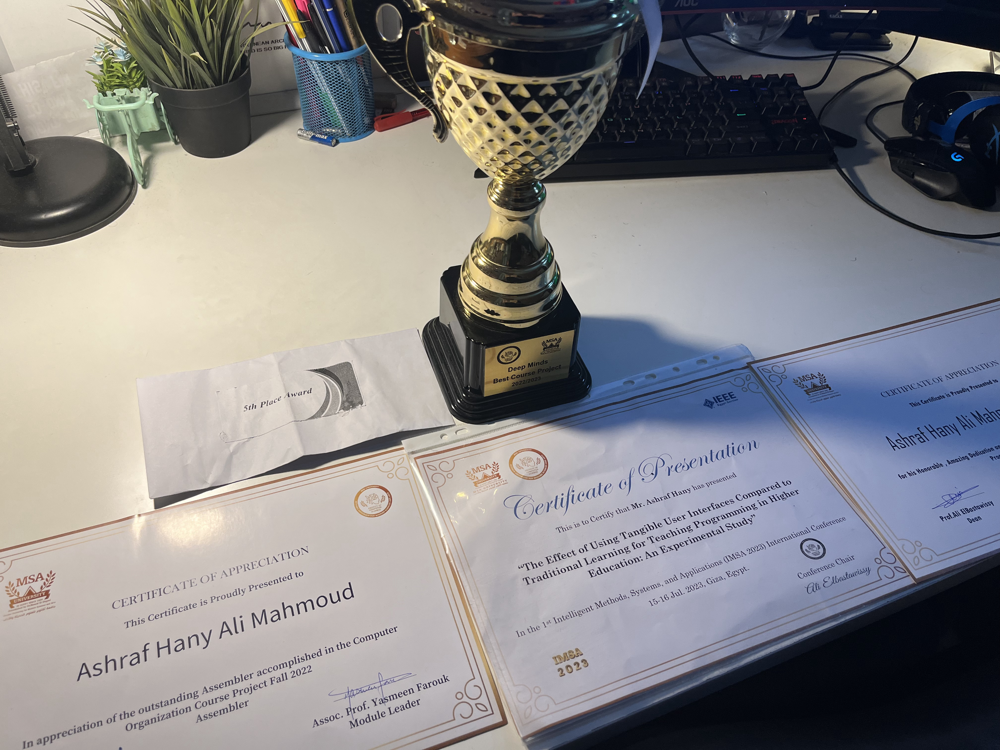

For me, this year was unbelievably rewarding. I went through many achievements and reached a lot of milestones that I honestly thought would take me forever to ever get to. I keep reflecting everyday on how I feel about all of this. Although I'm very grateful for every single award and proud of all these achievements. I wanted to reflect a bit on how all of this made me feel eventually so this blog post will be a bit personal where I will share how my thoughts were back then.

### Fall 2022

Starting the 22/23 academic year from Fall 2022 Semester, I was unwell. I don't feel the need to explain what happened to me on the blog here but let's just say that I was suffering quite hard and things felt quite dark. I went through a traumatic phase that eventually left me feeling unwell and took almost 11 months to recover from.

It was only through that hardship that I decided to pull everything together and focus on one thing which was, studying. At that time, I did nothing but study 24/7. And from there...things got to a really good point. 

Solzhenitsyn, a Russian author who helped to raise global awareness of political repression in the Soviet Union, had once talked about when he was in the camps, that at least if he was laying bricks in a wall, or a bricklayer was doing so, at least he had the satisfaction of building something, there was some tiny iota of meaning in the work, something redemptive in that, a crumb of meaning that you could feast on in the midst of your starvation. 

### Per Aspera Ad Astra

When I first learned that Idea, I thought about it for a long time. I thought that this could be my antidote. That the only way out of any suffering was to allow yourself to have some hope. Although it seems paradoxical but it is true. Also, there's one advantage to specifying darkness to that extent, when you specify something that precisely, you are also specifying it's opposite, so if you are living to a great extent in horrible suffering and darkness, then, at least in principle, there exists the opposite of that. So while I was looking into the heart of darkness, let's say, the light started to shine through. 

Moreover, I also came to realize that people often suffer dreadfully. And it's very difficult for a person to suffer dreadfully without getting bitter and resentful. But it doesn't help! All it does is that it makes the suffering worse and spreads it. And so I came to realize that the best way to suffer is to do so with a moral justification in mind. 

"Yes, I'm suffering, but at least I'm learning a valuable lesson out of it and it is that...(whatever it is you should learn from what happened to you)"

And so I adopted that mindset. I told myself, "Look, you are suffering and you have every valid reason to be a complete screw up and everyone would excuse you for not being able to pull through. But hey, wouldn't it be nice if you accomplished something remarkable and looked back on this one day and saw that you came out of it with many achievements?". 

And so I did, by the end of that fall semester, I had scored a GPA of 4 out of 4, founded a community club and had been awarded multiple times. By the end of the academic year, I had published my first research paper. 
 

Even more, by the end of 2023, I had secured my first internship at the National Bank of Egypt, freelanced as a full-stack developer, and met the Former Minister of Education. 

### Conclusion 

This experience has strengthened my belief in Solzhenitsyn's words: the only way to overcome suffering is by holding on to hope. It’s important not to let suffering make us bitter or resentful, as those feelings only worsen the pain and leave us angry. The quote at the footer of this website, Per Aspera Ad Astra — "Through hardships to the stars" — is something I now carry with me everywhere.

I also reflect often on this text from Peterson's book, *12 Rules for Life*:
> You must determine where you are going, so that you can bargain for yourself, so that you don’t end up resentful, vengeful and cruel. You have to articulate your own principles, so that you can defend yourself against others’ taking inappropriate advantage of you, and so that you are secure and safe while you work and play. You must discipline yourself carefully. You must keep the promises you make to yourself, and reward yourself, so that you can trust and motivate yourself. You need to determine how to act toward yourself so that you are most likely to become and to stay a good person. It would be good to make the world a better place. Heaven, after all, will not arrive of its own accord. We will have to work to bring it about, and strengthen ourselves, so that we can withstand the deadly angels and flaming sword of judgment that God used to bar its entrance.

Yes, suffering is inevitable, but it also presents the chance to transform that pain into something extraordinary. As humans, we are capable of achieving whatever we set our minds to, and in our hardest moments, I hope we choose to set our minds on the right things.